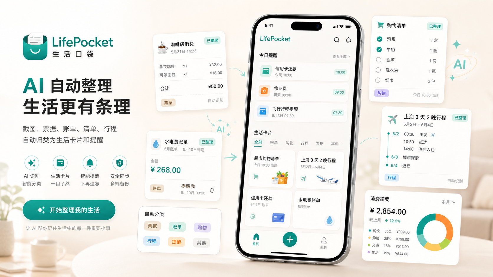

# LifePocket

> Version 1.0.0

[中文](README.md) | [English](README.en.md)


LifePocket is a mobile-first AI life organization app. Users can upload screenshots, receipts, bills, appointments, shopping orders, travel information, or paste plain text. The app calls the model API configured by the user and turns scattered everyday information into life cards, reminders, expense records, reusable checklists, and AI conversations.

The repository contains:

- `apps/mobile`: the Expo / React Native mobile app and the primary 1.0.0 product.
- `app`, `components`, `lib`: a Next.js Web Demo for product presentation and lightweight previews.
- `docs`: user manual, privacy notes, and supporting documentation.

## Highlights



### AI Upload Recognition

- Pick an image from the gallery.
- Take a photo and recognize it.
- Paste text for recognition.
- Supports receipts, bills, appointments, shopping screenshots, travel information, warranty proofs, todos, and notes.
- A single image or text block can produce multiple life cards when it contains multiple independent records.
- Recognition results can be saved one by one or all at once.

### Life Cards

- Save everyday information as structured cards: expense, bill, appointment, shopping, travel, warranty, todo, note, or unknown.
- Manage card states: active, done, and archived.
- View details, edit type, update status, set reminders, archive, or delete.
- Active cards are prioritized on the home screen. Archived cards are hidden from the main list but are not deleted.

### Expense Tracking

- Calculates expense statistics from locally saved life cards.
- Supports daily, weekly, and monthly summaries.
- Tap a daily / weekly / monthly card to view matching expense details.
- Tap a category to view category details.
- Expense detail rows can open the source life card.

### AI Checklists

- Enter a life scenario such as “weekend camping”, “moving preparation”, or “dental appointment”.
- AI generates a practical checklist and saves it into history.
- View and manage multiple historical checklists.
- Edit title, summary, quantity, category, and checklist items.
- Add, delete, and check off items.
- Data is saved locally and remains available after restarting the app.

### AI Chat

LifePocket includes a large-model chat page with two modes:

- Record-based chat: summarizes local life cards and lists, then lets the model answer questions such as “How much did I spend this month?” or “What active tasks do I still have?”
- General life assistant: supports text questions and photo-based questions.

Record-based chat only sends compressed summaries. It does not send full images, full tokens, or complete sensitive raw text.

### Multiple Model Configurations

- Configure multiple OpenAI Chat Completions compatible endpoints.
- Supports InternLM, OpenAI-compatible endpoints, and custom providers.
- Configure Endpoint, Model, API Token, and whether the model supports vision input.
- Choose the default model used by upload recognition, checklist generation, and chat.
- Tokens are stored locally with secure storage and are never hardcoded.

## Tech Stack

### Mobile App

- Expo
- React Native
- Expo Router
- TypeScript
- AsyncStorage
- expo-secure-store
- expo-image-picker
- expo-notifications
- OpenAI-Compatible Chat Completions API

### Web Demo

- Next.js 14
- React 18
- TypeScript
- Tailwind CSS
- Reserved Supabase schema

## Project Structure

```text
.
├── app/                         # Next.js Web Demo pages
├── components/                  # Web Demo components
├── lib/                         # Web Demo mock data and utilities
├── public/                      # Web assets
├── docs/
│   ├── user-manual.md           # Mobile app user manual
│   └── privacy-android-internal.md
├── apps/
│   └── mobile/
│       ├── app/                 # Expo Router pages and routes
│       │   ├── (tabs)/          # Home, Upload, Expenses, Lists, Chat, Settings
│       │   ├── expenses/        # Expense detail route
│       │   ├── items/           # Life card detail route
│       │   └── lists/           # Checklist detail route
│       ├── assets/              # Mobile assets
│       └── src/
│           ├── components/      # Mobile UI primitives
│           ├── constants/       # Type, status, and list metadata
│           ├── prompts/         # Recognition, checklist, and chat prompts
│           ├── services/        # Model client, recognition, notifications
│           ├── storage/         # Local cards, lists, model configs, token storage
│           ├── types/           # TypeScript models
│           └── utils/           # JSON, dates, expense stats, context summaries
├── supabase/                    # Reserved database schema
└── README.md
```

## Quick Start

### Run the Mobile App

```bash
cd apps/mobile
npm install
npx expo start
```

Then choose one of the Expo options:

- Scan the QR code with Expo Go on a physical device.
- Press `a` to open an Android emulator.
- Press `i` to open an iOS simulator. macOS and Xcode are required.
- Press `w` to open the Expo web preview.

Type check:

```bash
cd apps/mobile
npm run typecheck
```

Android preview build:

```bash
cd apps/mobile
npm run build:android:preview
```

### Run the Web Demo

```bash
npm install
npm run dev
```

Open:

```text
http://localhost:3000
```

Production build:

```bash
npm run build
npm run start
```

## First-Time App Setup

1. Open the mobile app.
2. Go to Settings.
3. Add or edit a model configuration.
4. Fill in the API Endpoint.
5. Fill in the Model name.
6. Paste your own API Token.
7. Enable vision input if the model supports image recognition.
8. Tap Test Connection.
9. Go back to Upload and start recognizing life information.

InternLM defaults:

```text
API Endpoint: https://chat.intern-ai.org.cn/api/v1/chat/completions
Model: intern-latest
```

The project does not include any sample API token. Users must apply for and enter their own token. The Settings page includes a button for the InternLM token page:

```text
https://internlm.intern-ai.org.cn/api/tokens
```

## Privacy and Security

- No API Token is built into the project.
- Tokens are entered by users.
- On mobile, tokens are stored with `expo-secure-store`.
- Web preview uses AsyncStorage as a fallback.
- Uploaded images, pasted text, and chat messages are sent to the currently selected model endpoint only when the user actively sends them.
- Record-based chat sends summaries only. It does not send full images, full tokens, or complete sensitive raw text.
- Avoid uploading IDs, bank cards, full contracts, sensitive receipts, or other highly sensitive documents.
- Do not commit `.env`, `.env.local`, real tokens, or private screenshots.

## Documentation

User manual:

```text
docs/user-manual.md
```

Android internal testing privacy note:

```text
docs/privacy-android-internal.md
```

## Development Checks

Root check:

```bash
npm run check
```

Mobile type check:

```bash
cd apps/mobile
npm run typecheck
```

Web build:

```bash
npm run build
```

## Version Status

LifePocket 1.0.0 includes:

- Upload recognition.
- Multi-record life card saving.
- Life card detail, type, and status management.
- Expense summaries and detail lists.
- Historical checklist generation and editing.
- AI chat.
- Multiple model API configurations.
- Local data storage and secure token storage.
- User manual and privacy notes.

Future directions:

- Cloud sync.
- Family sharing.
- Offline OCR.
- More complete reminder rules.
- Deeper expense analytics.
- Desktop or full Web data support.

## License

This project is licensed under the MIT License.

See [LICENSE](LICENSE) for details.
