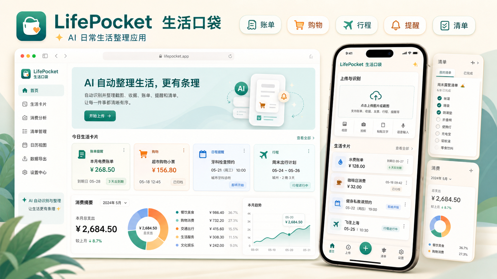

# LifePocket / 生活口袋

> Version 1.0.0

[中文](README.md) | [English](README.en.md)



LifePocket / 生活口袋 是一个以手机端 App 为主的 AI 日常生活整理工具。用户可以上传截图、小票、账单、预约、购物订单、旅行信息，或直接粘贴文字；App 会调用用户自己配置的大模型 API，把零散生活信息整理成生活卡片、提醒、消费记录、历史清单和对话分析。

项目当前包含：

- `apps/mobile`：Expo / React Native 手机 App，当前主版本功能入口。
- `app`、`components`、`lib`：Next.js Web Demo，用于产品展示和轻量演示。
- `docs`：用户手册、隐私说明等文档。

## 核心功能

### AI 上传识别

- 支持从相册选择图片。
- 支持拍照识别。
- 支持粘贴文本识别。
- 支持小票、账单、预约、购物截图、旅行信息、保修凭证、待办和备忘。
- 一张图片或一段文本中包含多条独立记录时，可以生成多张生活卡片。
- 识别结果支持单独保存或一键保存全部。

### 生活卡片

- 按类型保存生活事项：消费记录、待支付账单、预约日程、购物订单、旅行行程、保修凭证、待办事项、普通备忘、未知类型。
- 支持卡片状态：待处理、已完成、已归档。
- 支持查看详情、编辑类型、更新状态、设置提醒、归档或删除。
- 首页优先展示待处理事项，归档不会删除数据。

### 消费统计

- 自动统计本地保存的消费记录。
- 支持今日、本周、本月消费汇总。
- 支持点击每日 / 每周 / 每月统计卡片查看明细。
- 支持按消费分类查看明细。
- 明细列表可进入来源生活卡片。

### AI 清单

- 输入生活场景生成清单，例如“周末露营”“搬家准备”“去医院看牙”。
- 清单会保存到历史记录。
- 支持查看多个历史清单。
- 支持编辑标题、说明、数量、分类和清单项。
- 支持添加、删除、勾选清单项。
- 本地保存，重启 App 后仍可查看。

### AI 对话

手机端新增“大模型对话”页面，包含两种模式：

- 基于记录：读取本地生活卡片和清单摘要，让模型回答“这个月花了多少钱”“最近有哪些待处理事项”等问题。
- 生活助手：支持文字咨询，也支持拍照或选择图片后向模型提问。

基于记录的对话只发送压缩摘要，不发送完整图片、完整 Token 或完整敏感原文。

### 多模型配置

- 支持配置多个 OpenAI Chat Completions 兼容接口。
- 支持书生模型、OpenAI 兼容接口和自定义接口。
- 支持配置 Endpoint、Model、API Token、是否支持视觉输入。
- 支持设置默认模型。
- 上传识别、清单生成和对话统一使用当前默认模型。
- Token 使用本地安全存储，不硬编码在代码中。

## 技术栈

### Mobile App

- Expo
- React Native
- Expo Router
- TypeScript
- AsyncStorage
- expo-secure-store
- expo-image-picker
- expo-notifications
- OpenAI-Compatible Chat Completions API

### Web Demo

- Next.js 14
- React 18
- TypeScript
- Tailwind CSS
- Supabase 预留 schema

## 项目结构

```text
.
├── app/                         # Next.js Web Demo 页面
├── components/                  # Web Demo 组件
├── lib/                         # Web Demo mock 数据和工具
├── public/                      # Web 静态资源
├── docs/
│   ├── user-manual.md           # 手机 App 用户手册
│   └── privacy-android-internal.md
├── apps/
│   └── mobile/
│       ├── app/                 # Expo Router 页面和路由
│       │   ├── (tabs)/          # 首页、上传、消费、清单、对话、设置
│       │   ├── expenses/        # 消费明细页
│       │   ├── items/           # 生活卡片详情页
│       │   └── lists/           # 清单详情页
│       ├── assets/              # App 图标等资源
│       └── src/
│           ├── components/      # 移动端基础 UI
│           ├── constants/       # 类型、状态、清单元信息
│           ├── prompts/         # 识别、清单、对话 Prompt
│           ├── services/        # 模型 Client、识别、通知服务
│           ├── storage/         # 本地数据、清单、模型配置、Token 存储
│           ├── types/           # TypeScript 类型
│           └── utils/           # JSON、日期、消费统计、记录摘要工具
├── supabase/                    # 预留数据库 schema
└── README.md
```

## 快速开始

### 运行手机 App

```bash
cd apps/mobile
npm install
npx expo start
```

启动后可以选择：

- 使用 Expo Go 扫码打开真机预览；
- 按 `a` 打开 Android 模拟器；
- 按 `i` 打开 iOS 模拟器，需要 macOS 和 Xcode；
- 按 `w` 打开 Expo Web 预览。

类型检查：

```bash
cd apps/mobile
npm run typecheck
```

Android 内测构建：

```bash
cd apps/mobile
npm run build:android:preview
```

### 运行 Web Demo

```bash
npm install
npm run dev
```

浏览器打开：

```text
http://localhost:3000
```

生产构建：

```bash
npm run build
npm run start
```

## App 初次使用

1. 打开手机 App。
2. 进入“设置”页。
3. 添加或编辑模型配置。
4. 填写 API Endpoint。
5. 填写 Model。
6. 填写自己的 API Token。
7. 如需图片识别，开启“支持图片识别 / 视觉输入”。
8. 点击“测试连接”。
9. 回到“上传”页开始识别。

书生模型默认配置可参考：

```text
API Endpoint: https://chat.intern-ai.org.cn/api/v1/chat/completions
Model: intern-latest
```

API Token 需要用户自行申请，项目不会内置任何示例 Token。设置页提供“前往申请 API Token”按钮，指向：

```text
https://internlm.intern-ai.org.cn/api/tokens
```

## 隐私与安全

- 项目不内置任何 API Token。
- Token 由用户自行填写。
- 手机端 Token 使用 `expo-secure-store` 保存。
- Web 预览环境使用 AsyncStorage 作为降级存储。
- 上传图片、粘贴文本、对话提问时，内容会发送到用户当前选择的模型接口。
- 基于记录的对话只发送摘要，不发送完整图片、完整 Token 或完整敏感原文。
- 不建议上传身份证、银行卡、完整合同、敏感票据等高敏感信息。
- 不要把 `.env`、`.env.local`、真实 Token 或个人隐私截图提交到仓库。

## 用户文档

普通用户使用说明见：

```text
docs/user-manual.md
```

Android 内测隐私说明见：

```text
docs/privacy-android-internal.md
```

## 开发检查

根目录检查：

```bash
npm run check
```

手机端类型检查：

```bash
cd apps/mobile
npm run typecheck
```

Web 构建：

```bash
npm run build
```

## 版本状态

LifePocket 1.0.0 已包含以下移动端功能闭环：

- 上传识别；
- 多记录生活卡片保存；
- 卡片详情、类型和状态管理；
- 消费汇总和明细；
- 历史清单生成与编辑；
- 大模型对话；
- 多模型 API 配置；
- 本地存储和 Token 安全存储；
- 用户手册和隐私说明。

后续可继续扩展：

- 云同步；
- 家庭共享；
- 离线 OCR；
- 更完整的提醒规则；
- 更丰富的消费分析；
- 桌面端或 Web 端真实数据接入。

## License

This project is licensed under the MIT License.

See [LICENSE](LICENSE) for details.
